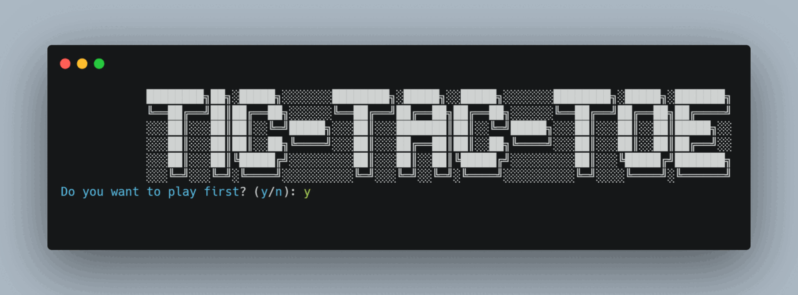

## TIC-TAC-TOE AI Minimax Algorithm and Alpha-Beta Pruning

|⭕|⭕|❌|
|:---:|:---:|:---:|
|❌|❌|⭕|
|⭕|❌|⭕|
### Goal
The goal of this project is to implement an unbetable AI that can play Tic-Tac-Toe against a human player. The AI will use the minimax algorithm with alpha-beta pruning to make its moves. 

### Vanilla Minimax Algorithm
The minimax algorithm is a recursive algorithm that is used in decision making and game theory to find the optimal move for a player, assuming that the opponent also plays optimally. The minimax algorithm creates a game tree that represents all possible states of the game and all possible moves for each player. It evaluates the leaf nodes of the game tree and assigns a score to each node. The score is based on whether the AI wins, loses, or draws. Then, the minimax algorithm chooses the move that leads to the node with the highest score. However, the minimax algorithm is not efficient because it evaluates all possible moves, even if the game is already won or lost. For tree with a depth of $n$, the minimax algorithm will evaluate $3^n$ nodes.

### Alpha-Beta Pruning
Alpha-beta pruning is a modification of the minimax algorithm that reduces the number of nodes that need to be evaluated. The alpha-beta pruning algorithm evaluates the nodes in the same way as the minimax algorithm, but it does not evaluate the nodes that are not necessary. The alpha-beta pruning algorithm keeps track of two values, **alpha** and **beta**. Alpha represents the best value that the maximizer currently can guarantee at that level or above. Beta represents the best value that the minimizer currently can guarantee at that level or above. If at any point, alpha is greater than or equal to beta, then the minimizer will never choose that branch because it will never be chosen. Therefore, the alpha-beta pruning algorithm does not need to evaluate the nodes in that branch. For tree with a depth of $n$, the alpha-beta pruning algorithm will evaluate $3^{n/2}$ nodes.

## ⚙ Usage
```bash
git clone  tictactoe.py
pip install -r requirements.txt
```
If `pip` doesn't work use `pip3` instead of `pip`.

## 💻 Demo
```bash
python tictactoe.py
```
If `python` doesn't work use `python3` instead of `python`.\



## 🚀 Author
Suraj Poudel

## 📝 License
[](https://opensource.org/licenses/MIT)